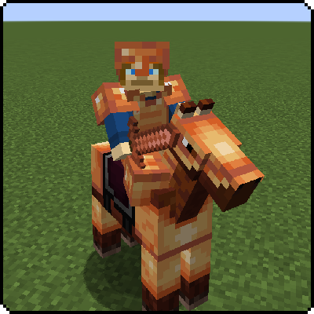
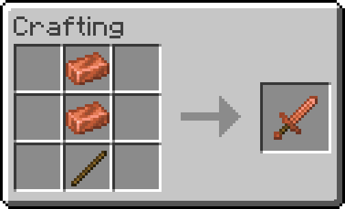
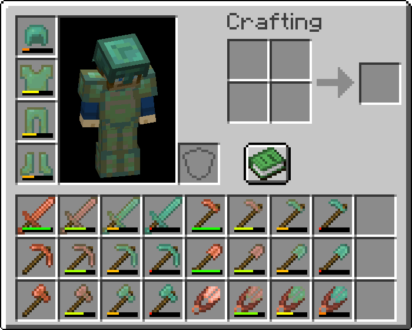

> **Language:** [Русский](README.md) · English

# Exline's Copper Equipment (Minecraft 1.21.4 Fabric Port)


Port and optimization of the **Exline's Copper Equipment** mod for **Minecraft 1.21.4 (Fabric)**.

Original Developer: [exline](https://modrinth.com/mod/exlines-copper-equipment).

---

## About

**Exline's Copper Equipment** introduces a complete set of tools, weapons, and armor made from copper, neatly filling the progression gap between leather/stone and iron.

---

## Gallery

| Copper Equipment | Crafting Recipes | Item Oxidation |
|:---:|:---:|:---:|
|  |  |  |

---

## Features

- **Full Copper Armor Set**: copper helmet, chestplate, leggings, and boots.
- **Copper Weapons & Tools**: copper sword, pickaxe, axe, shovel, and hoe.
- **Copper Bucket & Shears**: handy survival utilities forged from copper.
- **Balanced Progression**: durability and damage values are balanced logically between stone and iron tiers.
- **Enchanting Support**: full support for vanilla enchanting and anvil repairs.

---

## Changes in 1.21.4 Port (byMr712)

- Full migration to **Minecraft 1.21.4** (Fabric Loader, Yarn mappings, Java 21 LTS).
- **Log spam fixed**: completely removed debug output (`tickCount: ..., bound: ...`) that flooded the console and log files on every single tick when copper armor was equipped.
- Updated item registration, armor components, and recipe definitions for the modern 1.21.4 API.
- Configured optimized build scripts.

---

## Installation

1. Download the latest release from [GitHub Releases](https://github.com/byMr712/ExlineCoppeRequipment-1.21.4-MinecraftMod/releases).
2. Requires:
   - [Fabric API](https://modrinth.com/mod/fabric-api)
3. Place the `.jar` file into your `mods` folder.
4. Launch the game.

---

## Building

1. Requires Java 21 and Fabric Loader for Minecraft 1.21.4.
2. To build the project, run:
   ```bash
   ./gradlew build
   ```
3. The built jar file will be located at `build/libs/ExlineCoppeRequipment-1.21.4-byMr712.jar`.

---

## Credits & License

- Original Author: [exline](https://modrinth.com/mod/exlines-copper-equipment).
- Ported and optimized for 1.21.4 by: [Mr712](https://github.com/byMr712).
- Distributed under the [MIT License](LICENSE).